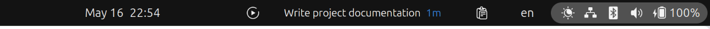

# Super Productivity Indicator

A minimal GNOME Shell extension that displays your current task and time spent today in the top panel.

- Appears when you start a task
- Disappears when you stop or complete a task
- Tested only on Ubuntu 26.04 LTS (GNOME 50)

## Requirements

- Super Productivity app installed with REST API enabled: **Settings → General → Misc → Enable REST API**


## Install

```bash
git clone https://github.com/ademb2/gnome-shell-extension-super-productivity.git ~/.local/share/gnome-shell/extensions/indicator@superproductivity.app
```

Then enable via **Extensions**.

## Screenshot

